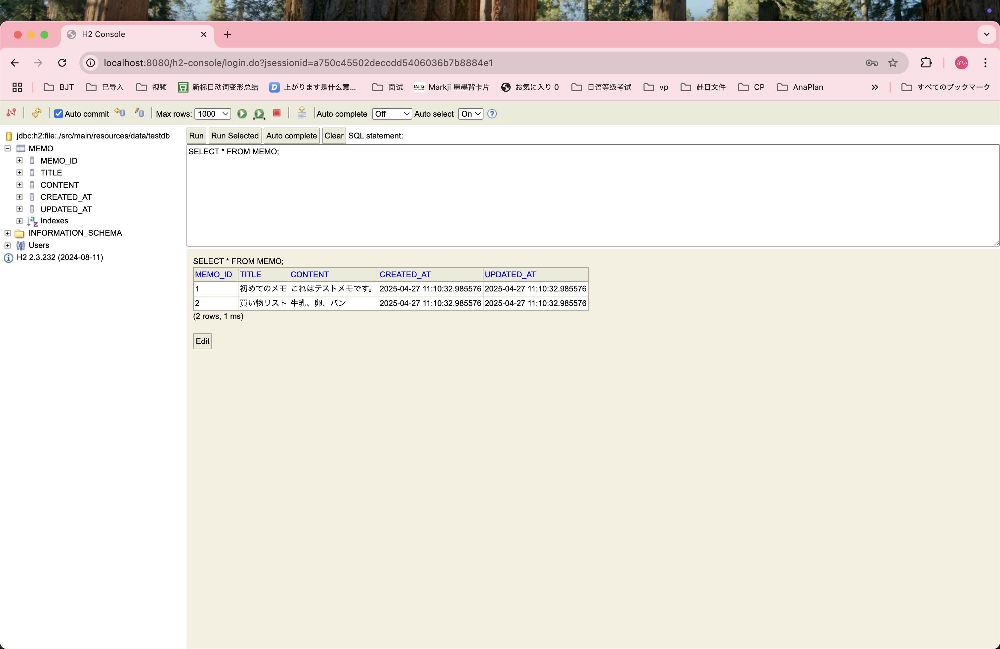
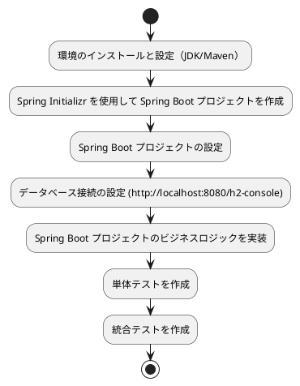
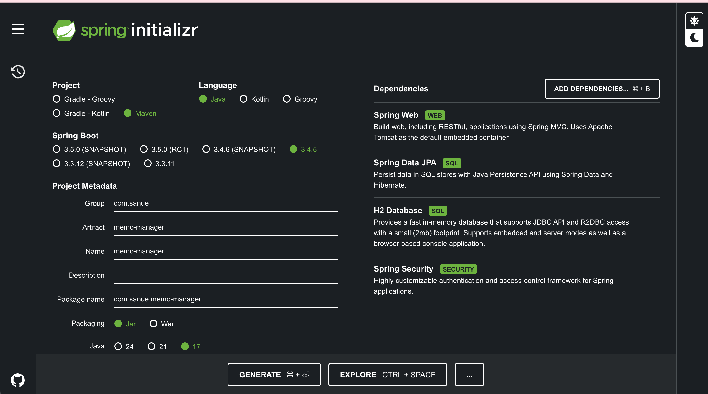

# 詳細設計書

## システム名
個人メモ管理システム（MemoManager）

## 作成者
汪 荷怡

## 作成日
2025年4月26日

---

## 1. システム概要
本システムは、個人ユーザーが自分のメモ情報を管理できるWebアプリケーションである。メモの作成、編集、削除、一覧表示などの基本機能を提供し、簡易なタスク管理やアイデア記録に活用できる。

---

## 2. 画面設計

### 2.1 メモ一覧画面

| 項目            | 詳細                                            |
|-----------------|-------------------------------------------------|
| 画面名          | メモ一覧画面                                    |
| 機能            | 登録済みメモの一覧を表示し、各メモに対する操作（編集、削除）ができる |
| 詳細            | メモの一覧を表示。各メモに「編集」「削除」ボタンを配置。メモの選択で詳細画面へ遷移可能。 |
| レイアウト        | メモ情報（タイトル、登録日時）をリスト表示。 |
| アクション       | メモ選択→メモ詳細画面へ遷移、削除ボタン→メモ削除API呼び出し |

### 2.2 メモ登録画面

| 項目            | 詳細                                            |
|-----------------|-------------------------------------------------|
| 画面名          | メモ登録画面                                    |
| 機能            | 新しいメモの作成。タイトルと内容を入力し、メモを追加する |
| 詳細            | 入力フォーム（タイトル、内容）を提供し、「保存」ボタンで新規メモを追加する。 |
| バリデーション   | タイトル、内容は必須入力、内容は最大1000文字まで |

### 2.3 メモ編集画面

| 項目            | 詳細                                            |
|-----------------|-------------------------------------------------|
| 画面名          | メモ編集画面                                    |
| 機能            | 既存メモの内容を編集し、変更を保存する           |
| 詳細            | 編集したいメモのタイトルと内容を表示し、「保存」ボタンで変更内容を更新する |
| バリデーション   | タイトル、内容は必須入力、内容は最大1000文字まで |

### 2.4 メモ詳細画面

| 項目            | 詳細                                            |
|-----------------|-------------------------------------------------|
| 画面名          | メモ詳細画面                                    |
| 機能            | 選択したメモの詳細情報を表示する                |
| 詳細            | メモのタイトルと内容を詳細表示。編集や削除リンクも提供 |

---

## 3. API設計

### 3.1 API一覧

| No   | API名称         | Method | パス                  | 機能概要                      |
|------|------------------|--------|-----------------------|-------------------------------|
| API001 | ログイン認証API | POST   | /api/login            | ユーザー認証しトークンを返す |
| API002 | メモ一覧取得API | GET    | /api/memos            | 全メモ情報を取得              |
| API003 | メモ登録API     | POST   | /api/memos            | 新規メモを登録                |
| API004 | メモ編集API     | PUT    | /api/memos/{id}       | 指定IDのメモを更新            |
| API005 | メモ削除API     | DELETE | /api/memos/{id}       | 指定IDのメモを削除            |

---

## 4. データベース設計

### 4.1 テーブル名

| 項目名      | 型             | 属性     | 必須 | 備考                  |
|-------------|----------------|----------|------|-----------------------|
| memoId      | INT            | 主キー   | ○    | 自動採番              |
| title       | VARCHAR(100)   | 一意     | ○    | メモのタイトル        |
| content     | TEXT           |          | ○    | メモの内容            |
| createdAt   | TIMESTAMP      |          | ○    | メモ登録日時          |
| updatedAt   | TIMESTAMP      |          | ○    | メモ更新日時          |

---

## 5. 業務フロー

1. ユーザーがログイン（任意）
2. ログイン成功後、メモ一覧画面が表示され、既存メモの操作（編集、削除、詳細確認）が可能
3. ユーザーが新規メモの登録、既存メモの編集・削除を行う
4. 各操作はREST APIを通じてバックエンドに通信し、データベースが更新される
5. プロジェクト作成フロー（JAVA）

---

## 6. 使用技術

- **フロントエンド**:
  React 18, React Router, React Hook Form, Axios
- **バックエンド**:
  java 24.0.1 SpringBoot 3.4.5, Maven 3.9.9
- **DB**: 
  H2（インストール不要、設定も簡単）
- **テスト**: JUnit 5(spring-boot-starter-test)

---

## 7. セキュリティ設計

1. **認証**: JWT（JSON Web Token）を使用したトークンベースの認証
2. **入力検証**: フォーム入力値に対するクライアントサイドとサーバサイド両方のバリデーション
3. **データ保護**: HTTPSによる通信の暗号化、パスワードのハッシュ化

---

## 8. テスト計画

### 8.1 単体テスト

- 各APIのレスポンスとエラーハンドリングの確認
- フロントエンドフォームのバリデーションテスト

### 8.2 結合テスト

- フロントエンドとバックエンドのAPI連携テスト
- メモ一覧の取得から編集、削除までの一連の操作を通じて動作確認

### 8.3 ユーザー（自分）受け入れテスト

- ユーザーインターフェースの操作性確認
- 実際のユーザーシナリオに基づいたテスト

